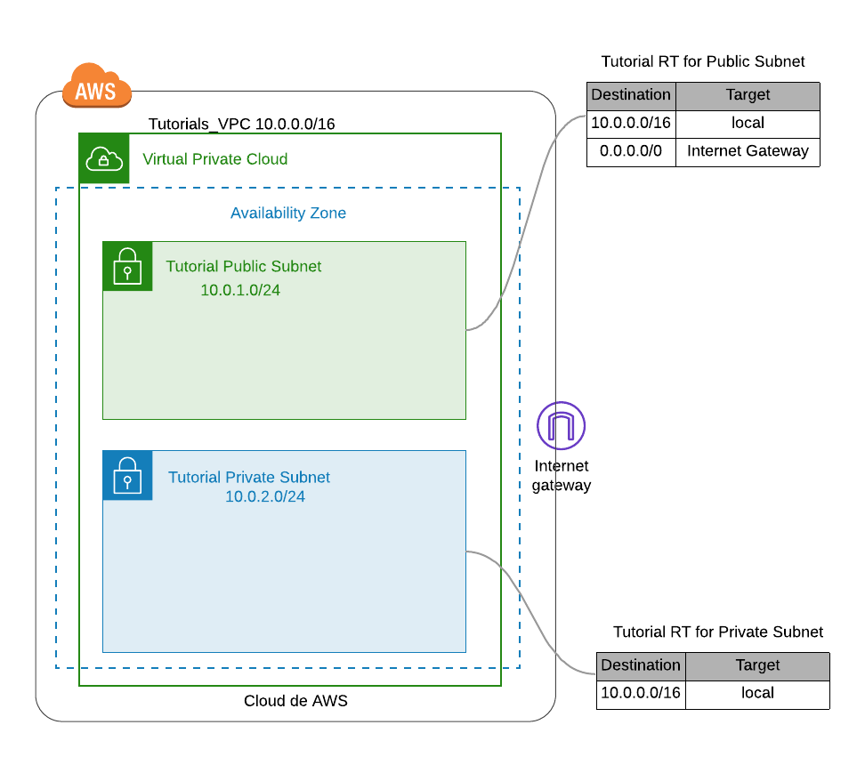

# AWS Tutorials

## [Jumpbox Architecture](jumpbox-architecture/)
From an Amazon EC2 instance in a private subnet of a VPC, try to communicate securely over the internet and  ping google.com

## [Static website on S3](static-page-s3)
Create an Amazon S3 bucket to host a static webpage that displays an image

## [Setup Jupyter Notebook on EC2](jupyter-notebook-ec2)
Setup Jupyter Notebook on an EC2 instance

## [Connect to RDS instance with Python](rds-connect)
Access to a MySQL RDS instance from Python, create a table and insert records 

## [Application Load Balancer w/Apache Web Server EC2's](alb-apache-web-server)
Host two identical web pages that display their respective IP on two EC2 instances behind an ELB so when the page is refreshed 
you get the first page sometimes and the second page other times. 

## [Copy S3 file with EC2 User Data (Part 1) ](ec2-user-data-s3-site)
Using EC2 user data at launch copy a php file from S3 and move it to the right folder to be displayed. S3 bucket should NOT be public.

## [Copy S3 file with EC2 User Data using Python (Part 2)](ec2-user-data-s3-site-python)
With a Python script launch and EC2 instance with user data, copy a php file from S3 and move it to the right folder to be displayed. S3 bucket should NOT be public.

## [Upload/download S3 files to EC2 using Python](s3-ec2-copy-file-python)
Write a Python script that uploads a file into S3, launches an EC2 instance and downloads the file into it, do some processing with the file and upload it
 back to S3 and shut down the EC2 instance

## [API interface for AWS Face Rekognition](face-rekognition)
Setup an API interface for AWS face Rekognition

## Digit Recognition MNIST  (WIP) 

## AWS Hands-On Tutorials:  
* [Build a Basic Web Application](https://aws.amazon.com/getting-started/hands-on/build-web-app-s3-lambda-api-gateway-dynamodb)
* [Unicorn web app](https://aws.amazon.com/getting-started/hands-on/build-serverless-web-app-lambda-apigateway-s3-dynamodb-cognito) 
* [Analyze Big Data with Hadoop](https://aws.amazon.com/getting-started/hands-on/analyze-big-data/)

For more tutoriasl: [AWS Hands-on](https://aws.amazon.com/getting-started/hands-on/)

# Pre-requisites

## Networking, VPC & Internet Gateway

### Step-1: VPC
Virtual Private cloud, is an isolated section of the AWS cloud where you can provision your infrastructure. 
**AWS Console** -> **Services** -> **VPC** -> **Your VPCs**
* Create VPC
* Choose **Name Tag**: Tutorials_VPC
* Specify a **IPv4 CIDR block**: 10.0.0.0/16
* Create

### Step-2: Internet Gateway
It is required for a subnet in order to be accessible to the internet since it allows internet traffict 
to and from your VPC.
Create an internet gateway and attach it to the VPC

**AWS Console** -> **Services** -> **VPC** -> **Internet Gateways**
* Create internet gateway
* Choose **Name Tag**: my-tutorials-internet-gateway
* Create

Choose the **internet gateway** -> **Actions** > **Attach to VPC** -> Select **Tutorials_VPC** -> **Attach internet gateway**

### Step-3: Public Subnet
Subnets are segments or partitions of a network divided by CIDR range.

**AWS Console** -> **Services** -> **VPC** -> Subnet
* Create subnet
* Choose **Name Tag**: Tutorial Public Subnet
* Choose the **VPC**: Tutorials_VPC
* Choose an **availability zone**: us-east-1a
* Specify an **IPv4 CIDR** block for the subnet from the range of your VPC: 10.0.1.0/24
* Create

### Step-4: Route table for public subnet
It specifies which external IP addresses are contactable from a subnet or internet gateway, in this case the private subnet is 
connected to the NAT Gateway and the public subnet is connected to the internet gateway.

**AWS Console** -> **Services** -> **VPC** ->Route Tables
* Create Route Table
* Choose **Name Tag**:  Tutorial RT for Public Subnet
* Choose the **VPC**: Tutorials_VPC
* Create

Go to the **Tutorial RT for Public Subnet** route table:

* Click on **Routes** tab -> **Edit routes**
* Click on **Add route** 
* Input 0.0.0.0/0 on the **destination** 
* On the **target** select **Internet Gateway** and the internet gateway my-tutorials-internet-gateway
* Save routes

Go to the subnet, click on **Edit route table association** and select the **Tutorial RT for Public Subnet**

### Step-5: Private Subnet
**AWS Console** -> **Services** -> **VPC** -> **Subnet**
* Create subnet
* Choose **Name Tag**: Tutorial Private Subnet
* Choose the **VPC**: Tutorials_VPC
* Choose an **availability zone**: us-east-1a
* Specify an **IPv4 CIDR** block for the subnet from the range of your VPC: 10.0.2.0/24 (it should not overlap with the other subnet)
* Create

### Step-6: Route table for private subnet
**AWS Console** -> **Services** -> **VPC** -> **Route Tables**
* Create Route Table
* Choose **Name Tag**:  Tutorial RT for Private Subnet
* Choose the **VPC**: Tutorials_VPC
* Create

## Architecture

        
