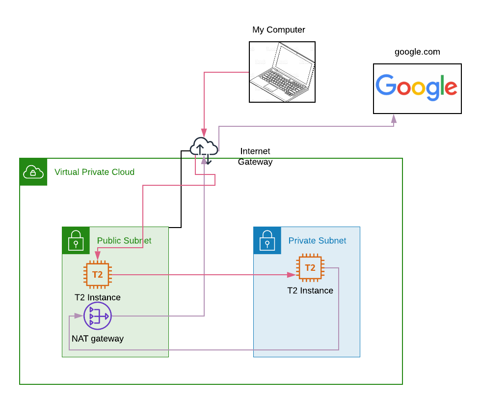

# Jumpbox Architecture

## Issue
I want to connect my EC2 instance in a private subnet of a VPC to communicate securely over the internet and be able to ping google.com


## Connecting to a private subnet
Instances within the same VPC can connect to one another through their private IP address, and therefore it is possible 
to connect to an instance in a private subnet from an instance in a public subnet.

Amazon instances require SSH keys for authentication, and we will need it to connect to the private instance as we do on 
the public one, but it is not safe at all to copy the private SSH key to the instance so we will require to forward the 
authentication request to our local machine. 
1. `sudo vi /etc/ssh/ssh_config`
2. Remove the # on the following lines so it looks like this: 
```
 Host *
 ForwardAgent yes
```

## Infrastructure

The infrastructure below has been manually set: 



**VPC**: Virtual Private cloud, is an isolated section of the AWS cloud where you can provision your infrastructure. 

**Subnets**: Subnets are segments or partitions of a network divided by CIDR range, in this case there is two subnets:
- Public Subnet: Subnet which traffic is routed to an internet gateway
- Private Subnet: Subnet which traffic does not have an internet gateway

**Internet Gateway**: It is required for a subnet in order to be accessible to the internet since it allows internet traffict 
to and from your VPC.

**Route table**: It specifies which external IP addresses are contactable from a subnet or internet gateway, in this case the private subnet is 
connected to the NAT Gateway and the public subnet is connected to the internet gateway.

**NAT Gateway**: Enables instances in private subnets to connect to the internet. The NAT Gateway must be deployed in the 
public subnet with an Elastic IP. Once it's created, a route table associated with the private subnet needs to point the traffic 
to the NAT Gateway.

**Security Groups**: Virtual firewall for your instance to control incoming and outgoing traffic. 

**EC2 Instance**: Virtual server 


## Solution

1. Create a VPC
2. Create an Internet Gateway and attach it to the VP
3. Create 2 subnets in the VPC (one public, one private) in the same availability zone
 
4. Edit the route table of the public subnet to direct internet traffic to the Internet Gateway

    | Destination  | Target |
    |  :---   | :---:  |
    | 10.0.0.0/16  | local  |
    | 0.0.0.0/0  | Internet Gateway  |

5. Create 2 EC2 instances (one in the public subnet and one in the private one)
6. Create a NAT Gateway in the public subnet with an unattached Elastic IP
7. Update the route table of the private subnet to direct internet-bound traffic to the NAT Gateway

    | Destination  | Target |
    |  :---   | :---:  |
    | 10.0.0.0/16  | local  |
    | 0.0.0.0/0  | NAT Gateway  |
    
8. ``ssh`` into your into your EC2 instance on the public subnet and from there ``ssh``  into the instance in the public subnet
9. Ping google.com