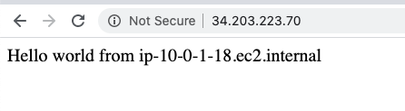
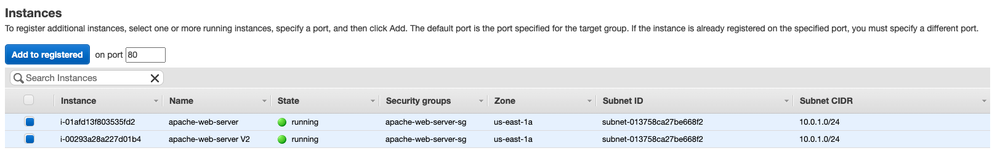
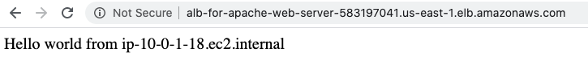

# Application Load Balancer w/Apache Web Server

Using two EC2 instances, host two identical web pages that display their respective IP behind an ELB so when the page is refreshed 
you get the first page sometimes and the second page other times. 

## Step-by-step
This guide assumes that a VPC, public and private subnet have already been created, refer to the documentation: [Pre-requisites](../README.md). 

## Step-1: Launch an EC2 instance in the public subnet
**AWS Console** -> **Services** -> **EC2** -> **Launch instance**

* Select Amazon Linux 2 AMI 
* Select General purpose t2.micro (free tier elegible) -> Configure Instance Details
* **Network**: Tutorials_VPC
* **Subnet**: Tutorial Public Subnet
* **Auto-assign Public IP**: Enable

### Advanced details: 
In **User data** input the following : 

    #!/bin/bash
    yum update -y
    yum install -y httpd.x86_64
    systemctl start httpd.service
    systemctl enable httpd.service
    echo "Hello world from $(hostname -f)" > /var/www/html/index.html
    
> NOTE: EC2 User Data is automatically run with the **sudo** command

* Click on **Next: Add Storage** -> **Next: Add Tags**
* Choose a **Name tag**: EC2 for Apache Web Server ALB -> Next: Configure Security Groups

### Security Groups:
* **Security Group Name**: apache-web-server-sg
* Rules

| Type      | Protocol | Port Range | Source    |
| :---:     |   :---:  | :---:      | :---      |
| SSH       | TCP      | 22         | 0.0.0.0/0 |
| HTTP      | TCP      | 80         | 0.0.0.0/0 |

---
## Step-2: Test connection 
Test that both of your instances are displaying its ip by pasting their public IP address into your browser

---
## Step-3: Public Subnet
**AWS Console** -> **Services** -> **VPC** -> Subnet
* Create subnet
* Choose **Name Tag**: Another Public Subnet for ALB
* Choose the **VPC**: Tutorials_VPC
* Choose an **availability zone**: us-east-1a
* Specify an **IPv4 CIDR** block for the subnet from the range of your VPC: 10.0.1.0/24
* Create

Select the **Another Public Subnet for ALB** subnet:
* Click on **Route Table**
* Click on  **Edit route table association**
* Select the **Tutorial RT for Public Subnet** (which has the internet gateway)
* Save
---
## Step-4: Application Load Balancer setup
**AWS Console** -> **Services** -> **EC2** -> **Load Balancers** -> **Create Load Balancer**

* Select create **Application Load Balancer**

### Step-4.1: Configure Load Balancer
### Basic configuration
* **Name**: alb-for-apache-web-server

### Listeners

| Load Balancer Protocol| Load Balancer Port|
| :---:                 |   :---:           |
| HTTP                  | 80                |

### Availability Zones

* **VPC**: Tutorials_VPC 
* **Availability Zones**: 
    - [x] **us-east-1a**: Tutorial public subnet
    - [x] **us-east-1b**: Another public subnet for ALB
* Click on **Next: Configure Security Settings** -> **Next: Configure Security Groups**

### Step-4.2: Configure Security Groups

* Assign a security group: Create a **new** security group
* Security group name: alb-for-apache-webserver

    | Type      | Protocol | Port Range | Source    |
    | :---:     |   :---:  | :---:      | :---      |
    | HTTP      | TCP      | 80         | 0.0.0.0/0 |
* Click on **Next: Configure Routing**

### Step-4.3: Configure Routing

### Target group
* **Target group**: New target group
* **Name**: tg-for-alb-apache-webserver
* **Target Type**: Instance
* **Protocol**: HTTP
* **Port**: 80 

### Health checks
* **Protocol**: HTTP
* **Path**: /
* Click on **Next: Register Targets**

### Step-4.4: Register Targets

* Select both instances that have **apache webserver** installed and click **Add to registered** 
* Review and create 

---
## Step-5: Security Group of EC2 instances
Go back to the security group that is attached to the EC2 instances **apache-web-server-sg** 
and modify the rules so we can only access the instances from the Load Balancer 

| Type      | Protocol | Port Range | Source    |
| :---:     |   :---:  | :---:      | :---      |
| SSH       | TCP      | 22         | 0.0.0.0/0 |
| HTTP      | TCP      | 80         | apache-web-server-sg |

---

## Step-6: Test the ALB 

Copy the DNS name from the basic configuration in the Load Balancer to the browser 
`alb-for-apache-web-server-583197041.us-east-1.elb.amazonaws.com`

