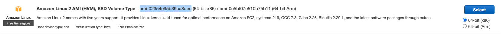

# Copy S3 file with EC2 User Data using Python (Part 2)
Using a Python script, launch an EC2 instance with EC2 **User Data** to install an Apache Web Server with PHP and copy a php file from a **non-public** S3 bucket.


## Step-by-step
This guide assumes that a VPC, public and private subnet have already been created, refer to the documentation: [Pre-requisites](../README.md). 

Make sure you also have followed [Copy S3 file with EC2 User Data](../ec2-user-data-s3-site/) because we will need to have configured the s3 bucket, 
IAM Role and security group. 

### Step-1: Create an IAM User
You must provide your AWS access keys to make programmatic calls to AWS or to use the AWS Command Line Interfac

**AWS console** -> **Service** -> **IAM** ->  **Users** -> **Add user**

* **User Name**: dpatron
* Select AWS Access Type
    - [x] Programmatic access
* **Set permissions**: Attach existing policies directly
    - [x] AmazonEC2FullAccess
* **Create user**
* **Download .csv**

Now you have your **Access Key ID** and **Secret access key** 

### Step-2: Configure AWS Credentials locally
After creating the user and getting the credentials, we need to configure it, open the terminal and run: 

```
aws configure
``` 

It will prompt you to provide the **Access Key ID**, **Secret Key**, **Default AWS region**, and **output format**. 
Once those are provided, credentials are saved in a local file at path **~/.aws/credentials** and other configurations 
like region are stored in **~/.aws/config** file.

Test that the credentials work, the following command should return details of any EC2 instance running on AWS in JSON format: 
```
aws ec2-describe-instances
```

### Step-3: Python Script

#### Key Pair for EC2 instance
Before we create the EC2 instance, we need to either create one key pair or re-use one so we can access our EC2 instace later.

```python
import boto3

session = boto3.Session(profile_name='default')
ec2 = session.client('ec2',region_name='us-east-1')
response = ec2.describe_key_pairs(KeyNames=['your_key_name'])
print(response)
```
> **NOTE**: Here I'm reusing one (I didn't upload it obviously), the response should be a JSON with meta-data of that key pair.
If you got an error verify your are using the correct **profile_name** where your credentials are stored and that your Key Pair file
has the correct permissions

 
#### Launch EC2 instance
We will need to gather a few id's to launch our instance with the same configuration as we did in [Copy S3 file with EC2 User Data](../ec2-user-data-s3-site/)

* **Amazon Machine Image ID**: `ami-02354e95b39ca8dec` (You can obtain the AMI ID from the AWS console in your browser when you launch and instance.)

  

* **Security Group ID**: `sg-09489316ac8b4d790` (apache-web-server-sg) 
* **Subnet ID**: `subnet-013758ca27be668f2` (Tutorial Public Subnet) 
* **IAM Role**: `EC2CopyFromS3`


Run the script **`launch_ec2.py`**:
```bash
python3 launch_ec2.py
```

For more information on what parameters can you send to create instances: [Boto3 Documentation - create_instances](https://boto3.amazonaws.com/v1/documentation/api/latest/reference/services/ec2.html#EC2.Subnet.create_instances)

### Step-4: Test the page
Grab the public ip from your EC2 instance and try it in your browser `{your-ec2-instance-public-ip}/amazons3.php`


## Cleanup 
* Delete the EC2 instance
* Delete the S3 bucket
