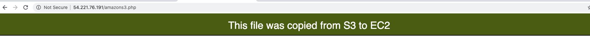

# S3 website from EC2 User Data 
Use EC2 **User Data** to install an Apache Web Server with PHP and copy a php file from a **non-public** S3 bucket.

### Step-1: Create a bucket on the aws console
**AWS console** -> **Service** -> **S3** ->  **Create bucket**

* **Bucket name**: website-hosting
* **Region**: US East (N.Virginia)
 -[x] Block all pubic access 
* Keep all other settings as default 
* **Create bucket**

* Upload the php file to the bucket: `amazons3.php`
 

## Step-2: Create an IAM Role
We need to authorize the EC2 instance to access the bucket in S3.

**AWS Console** -> **Services** -> **IAM** -> **Roles** -> **Create role**

* Select type of trusted entity: AWS Service
* Choose a use case: EC2
* Select your use case: Allows EC2 instances to call AWS services on your behalf
* Click on **Next: Permissions**
* Attach permissions policy: select **AmazonS3FullAccess** 
* **Role name**: EC2CopyFilesFromS3
* **Role description**: Allow EC2 instances to have access to S3

 
## Step-3: Launch an EC2 instance in a public subnet
**AWS Console** -> **Services** -> **EC2** -> **Launch instance**

* Select Amazon Linux 2 AMI 
* Select General purpose t2.micro (free tier elegible) -> Configure Instance Details
* **Network**: Tutorials_VPC
* **Subnet**: Tutorial Public Subnet
* **Auto-assign Public IP**: Enable
* **IAM Role**: EC2CopyFilesFromS3

### Advanced details: 
In **User data** input the following : 

    #!/bin/bash
    yum update -y
    yum install -y httpd 
    amazon-linux-extras install -y php7.2
    systemctl start httpd.service
    systemctl enable httpd.service
    aws s3 cp s3://site-for-ec2-user-data/amazons3.php /var/www/html
    
    
    
> NOTE: EC2 User Data is automatically run with the **sudo** command.

* Click on **Next: Add Storage** -> **Next: Add Tags**
* Choose a **Name tag**: EC2 for Apache Web Server ALB -> Next: Configure Security Groups

### Security Groups:
* **Security Group Name**: apache-web-server-sg
* Rules

| Type      | Protocol | Port Range | Source    |
| :---:     |   :---:  | :---:      | :---      |
| SSH       | TCP      | 22         | 0.0.0.0/0 |
| HTTP      | TCP      | 80         | 0.0.0.0/0 |

## Step-4: Test the page
Grab the public ip from your EC2 instance and try it in your browser `{your-ec2-instance-public-ip}/amazons3.php`

TODO: Write a Script in Python that launches an instance, attach use data and does the previous task: 
Services: 
IAM
Boto3
Secret Key
Access Key 
