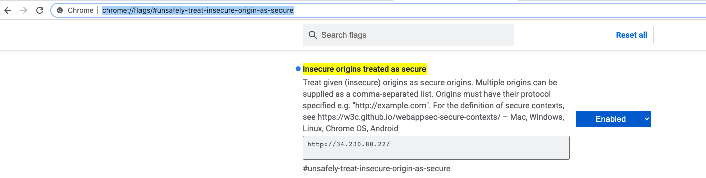

# API interface for face recognition using AWS Rekognition
Setup a simple API for face recognition using AWS Rekognition service.

## Step-by-step
This guide assumes that a VPC, public and private subnet have already been created, refer to the documentation: [Pre-requisites](../README.md). 
We must have either two private subnets or two public subnets available to create a DB subnet group for a DB instance to use in a VPC. 

### Step-1: Front-end 
#### Step-1.1: Launch EC2 w/Ubuntu and Apache on it
**AWS Console** -> **Services** -> **EC2** -> **Launch instance**

* Select Ubuntu Server 18.04 LTS 
* Select General purpose t2.micro (free tier elegible) -> Configure Instance Details
* **Network**: Tutorials_VPC
* **Subnet**: Tutorial Public Subnet
* **Auto-assign Public IP**: Enable

#### Advanced details: 
In **User data** input the following : 

    #!/bin/bash
    apt update
    apt install -y apache2 
    systemctl start apache2.service
    git clone https://github.com/dianapatrong/aws-tutorials.git
    mv -r aws-tutorials/face-rekognition/front-end/* /var/www/html/

     
> NOTE: EC2 User Data is automatically run with the **sudo** command.

* Click on **Next: Add Storage** -> **Next: Add Tags**
* Choose a **Name tag**: EC2 for Apache Web Server -> Next: Configure Security Groups

#### Security Groups:
* **Security Group Name**: front-end-sg-face-rekognition
* Rules

| Type      | Protocol | Port Range | Source    |
| :---:     |   :---:  | :---:      | :---      |
| SSH       | TCP      | 22         | 0.0.0.0/0 |
| HTTP      | TCP      | 80         | 0.0.0.0/0 |

#### Step-1.2: Verify connection 

Go to `http://<your-ec2-instance-public-ip>`

On chrome, you may need to allow the site to get access to your webcam by going to the following option
in your browser (`chrome://flags/#unsafely-treat-insecure-origin-as-secure`)

> NOTE: To avoid this step you need to create a certificate for the site 

### Step-2: Back-end
#### Step-2.1: Launch EC2 w/Ubuntu and Python
**AWS Console** -> **Services** -> **EC2** -> **Launch instance**

* Select Ubuntu Server 18.04 LTS 
* Select General purpose t2.micro (free tier elegible) -> Configure Instance Details
* **Network**: Tutorials_VPC
* **Subnet**: Tutorial Public Subnet
* **Auto-assign Public IP**: Enable

#### Advanced details: 
In **User data** input the following : 
  
     #!/bin/bash
     apt-get update -y
     cd /home/ubuntu/
     git clone https://github.com/dianapatrong/aws-tutorials.git
     cd aws-tutorials/face-rekognition/back-end
     apt install python3
     apt-get install -y python3-venv
     python3 -m venv flask_venv
     source flask_venv/bin/activate
     pip install -r requirements.txt
     nohup python my_rek_app.py &
        
> NOTE: EC2 User Data is automatically run with the **sudo** command.

* Click on **Next: Add Storage** -> **Next: Add Tags**
* Choose a **Name tag**: EC2 for Apache Web Server -> Next: Configure Security Groups

#### Security Groups:
* **Security Group Name**: back-end-sg-face-rekognition
* Rules
  
| Type      | Protocol | Port Range | Source    |
| :---:     |   :---:  | :---:      | :---      |
| SSH       | TCP      | 22         | 0.0.0.0/0 |
| Custom TCP| TCP      | 5000       | 0.0.0.0/0 |

### Step-3: Link front-end with back-end

