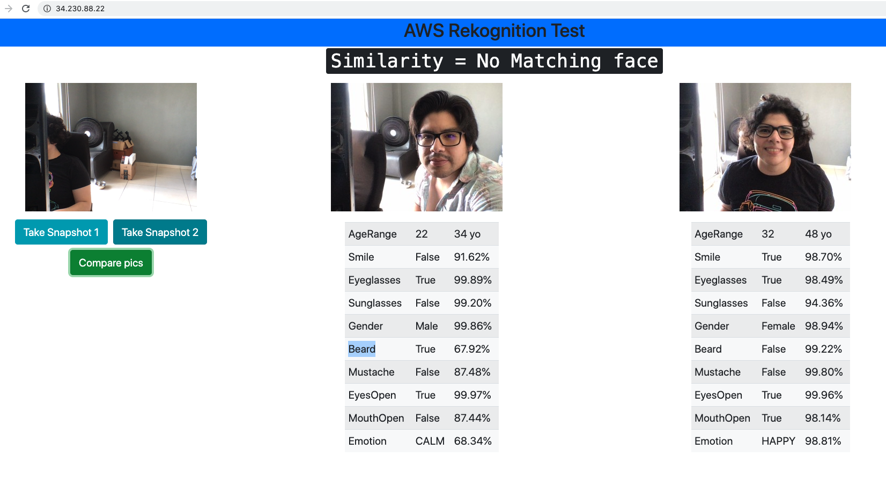

# API interface for face recognition using AWS Rekognition
Setup a simple API for face recognition using AWS Rekognition service.

## Step-by-step
This guide assumes that a VPC, public and private subnet have already been created, refer to the documentation: [Pre-requisites](../README.md). 
We must have either two private subnets or two public subnets available to create a DB subnet group for a DB instance to use in a VPC. 

### Step-1: Front-end
#### Step-1.1: Launch EC2 w/Ubuntu and Apache on it
**AWS Console** -> **Services** -> **EC2** -> **Launch instance**

* Select Ubuntu Server 18.04 LTS 
* Select General purpose t2.micro (free tier elegible) -> Configure Instance Details
* **Network**: Tutorials_VPC
* **Subnet**: Tutorial Public Subnet
* **Auto-assign Public IP**: Enable

#### Advanced details: 
In **User data** input the following : 

    #!/bin/bash
    apt update
    apt install -y apache2 
    systemctl start apache2.service
    git clone https://github.com/dianapatrong/aws-tutorials.git
    mv -r aws-tutorials/face-rekognition/front-end/* /var/www/html/

     
> NOTE: EC2 User Data is automatically run with the **sudo** command.

* Click on **Next: Add Storage** -> **Next: Add Tags**
* Choose a **Name tag**: EC2 for Apache Web Server -> Next: Configure Security Groups

#### Security Groups:
* **Security Group Name**: front-end-sg-face-rekognition
* Rules

| Type      | Protocol | Port Range | Source    |
| :---:     |   :---:  | :---:      | :---      |
| SSH       | TCP      | 22         | 0.0.0.0/0 |
| HTTP      | TCP      | 80         | 0.0.0.0/0 |

#### Step-1.2: Verify connection 

Go to `http://<your-ec2-instance-public-ip>`

On chrome, you may need to allow the site to get access to your webcam by going to the following option
in your browser (`chrome://flags/#unsafely-treat-insecure-origin-as-secure`)

> NOTE: To avoid this step you need to create a certificate for the site 

### Step-2: Create S3 bucket
**AWS console** -> **Service** -> **S3** ->  **Create bucket**

* **Bucket name**: face-rekognition-app
* **Region**: US East (N.Virginia)
 -[x] Block all pubic access 
* Keep all other settings as default 
* **Create bucket**

> NOTE: In the python file **my_rek_app.py** change the bucket name for the one you have defined 

### Step-3: Create an IAM Role 
We need to authorize the EC2 instance to access the bucket in S3 and access to Rekognition

**AWS Console** -> **Services** -> **IAM** -> **Roles** -> **Create role**

* Select type of trusted entity: AWS Service
* Choose a use case: EC2
* Select your use case: Allows EC2 instances to call AWS services on your behalf
* Click on **Next: Permissions**
* Attach permissions policy: 
    - [x] **AmazonS3FullAccess** 
    - [x] **AmazonRekognitionFullAccess** 
* **Role name**: Rekognition_S3
* **Role description**: Rekognition App
* Create role

### Step-4: Back-end
#### Step-4.1: Launch EC2 w/Ubuntu and Python
**AWS Console** -> **Services** -> **EC2** -> **Launch instance**

* Select Ubuntu Server 18.04 LTS 
* Select General purpose t2.micro (free tier elegible) -> Configure Instance Details
* **Network**: Tutorials_VPC
* **Subnet**: Tutorial Public Subnet
* **Auto-assign Public IP**: Enable
* **IAM Role**: Rekognition_S3

#### Advanced details: 
In **User data** input the following : 
  
     #!/bin/bash
     apt-get update -y
     cd /home/ubuntu/
     git clone https://github.com/dianapatrong/aws-tutorials.git
     cd aws-tutorials/face-rekognition/back-end
     apt install python3
     apt-get install -y python3-venv
     python3 -m venv flask_venv
     source flask_venv/bin/activate
     pip install -r requirements.txt
     nohup python my_rek_app.py &
        
> NOTE: If you need to stop your flask service `pgrep  python` and `sudo kill -9 <PID>`

* Click on **Next: Add Storage** -> **Next: Add Tags**
* Choose a **Name tag**: EC2 for Apache Web Server -> Next: Configure Security Groups

#### Security Groups:
* **Security Group Name**: back-end-sg-face-rekognition
* Rules
  
| Type      | Protocol | Port Range | Source    |
| :---:     |   :---:  | :---:      | :---      |
| SSH       | TCP      | 22         | 0.0.0.0/0 |
| Custom TCP| TCP      | 5000       | 0.0.0.0/0 |

> NOTE: Port 5000 is opened because is the one used by flask (defined in the python file)

### Step-5: Link front-end with back-end

* Go to the front-end instance 

    `ssh -i "your_key.pem" ubuntu@front-end-ec2-public-ip`

* Change the IP of the server in `/var/www/html/static/index.js`
  
  `sudo vi /var/www/html/static/index.js`
  
  Replace `'IP of your Server'` with the public ip of the EC2 instance for the back-end
  
  

### Test it! 
Go to the public IP of your front-end EC2 instance and take pictures

## Clean up
* Delete EC2 instances
* Delete S3 bucket
