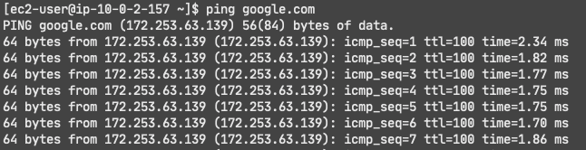
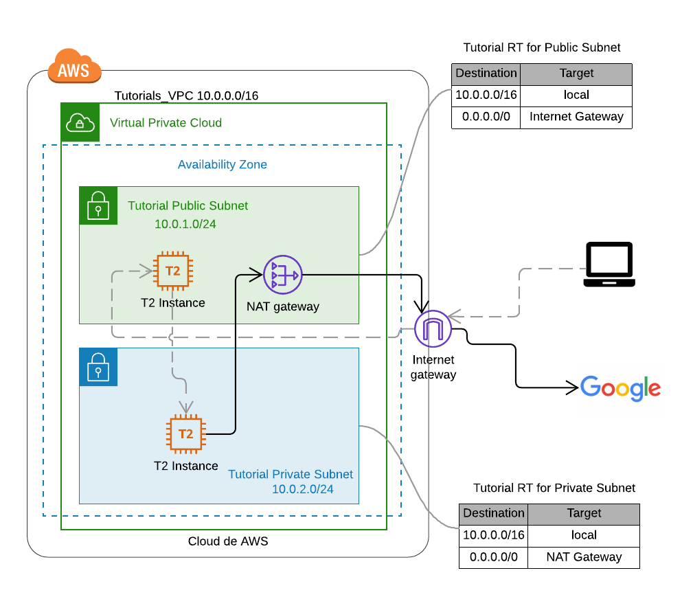

# Jumpbox Architecture


## Connecting to a private subnet
Instances within the same VPC can connect to one another through their private IP address, and therefore it is possible 
to connect to an instance in a private subnet from an instance in a public subnet, the goal for this tutorial is to ping google.com
from an instance in a private subnet. 

## Step-by-step
This guide assumes that VPC and public subnet have already been created, refer to the documentation: [Pre-requisites](../README.md). 

### Step-1: NAT GATEWAY
Enables instances in private subnets to connect to the internet but prevent the internet from initiating a connection with those instances. 
The NAT Gateway must be deployed in the public subnet with an Elastic IP. Once it's created, a route table associated with the private subnet needs 
to point the traffic to the NAT Gateway.

AWS Console -> Services -> VPC -> NAT Gateway
* Create NAT Gateway
* Choose the Name Tag: my-tutorials-nat-gateway
* Choose the subnet (must be the public subnet we just created): Tutorial Public Subnet
* Click on **Allocate Elastic IP**
* Create NAT gateway

      
### Step-2: Private Subnet
AWS Console -> Services -> VPC -> Subnet
* Create subnet
* Choose Name Tag: Tutorial Private Subnet
* Choose the VPC: Tutorials_VPC
* Choose an availability zone: us-east-1a
* Specify an IPv4 CIDR block for the subnet from the range of your VPC: 10.0.2.0/24 (it should not overlap with the other subnet)
* Create

AWS Console -> Services -> VPC -> Route Tables
* Create Route Table
* Choose Name Tag:  Tutorial RT for Private Subnet
* Choose the VPC: Tutorials_VPC
* Create

Go to the **Tutorial RT for Private Subnet** route table:
* Click on **Routes** tab -> **Edit routes**
* Click on **Add route** 
* Input 0.0.0.0/0 on the **destination** 
* On the **target** select **NAT Gateway** and the NAT gateway my-tutorials-nat-gateway
* Save routes

    | Destination  | Target |
    |  :---   | :---:  |
    | 10.0.0.0/16  | local  |
    | 0.0.0.0/0  | NAT Gateway  |

* Go to the subnet, click on **Edit route table association** and select the **Tutorial RT for Private Subnet**

### Step-3: EC2 Instances
We need two instances, one in the private subnet and one in the public subnet: 

AWS Console -> Services -> EC2
* Launch instance
* Select Amazon Linux 2 AMI 
* Select General purpose t2.micro (free tier elegible) -> Configure Instance Details
* Network: Tutorials_VPC
* Subnet: Tutorial Public Subnet
* Auto-assign Public IP: Enable -> Next: Add Storage -> Next: Add Tags
* Choose a Name tag: My First EC2 in public subnet -> Next: Configure Security Groups
* Security Group Name: my-sg-for-public-instance
* Rules should be set to only ssh in port 22
* Review and launch -> Launch (don't forget to download the key pair)

Repeat the previous steps but now in **Subnet** select **Tutorial Private Subnet**  and leave **Auto-assign Public IP** with its default


### Step-5: ssh_config 
Amazon instances require SSH keys for authentication, and we will need it to connect to the private instance as we do on 
the public one, but it is not safe at all to copy the private SSH key to the instance so we will require to forward the 
authentication request to our local machine. 
1. `sudo vi /etc/ssh/ssh_config`
2. Remove the # on the following lines so it looks like this: 
```
 Host *
 ForwardAgent yes
```

### Step-6: ssh into the instances`
* ssh into your public instance using the key `ssh -i "S20KP.pem" ec2-user@public-instance`
* ssh into the private instance within the public one  `ssh ec2-user@private-instance`
* ``ping google.com``



## Architecture
