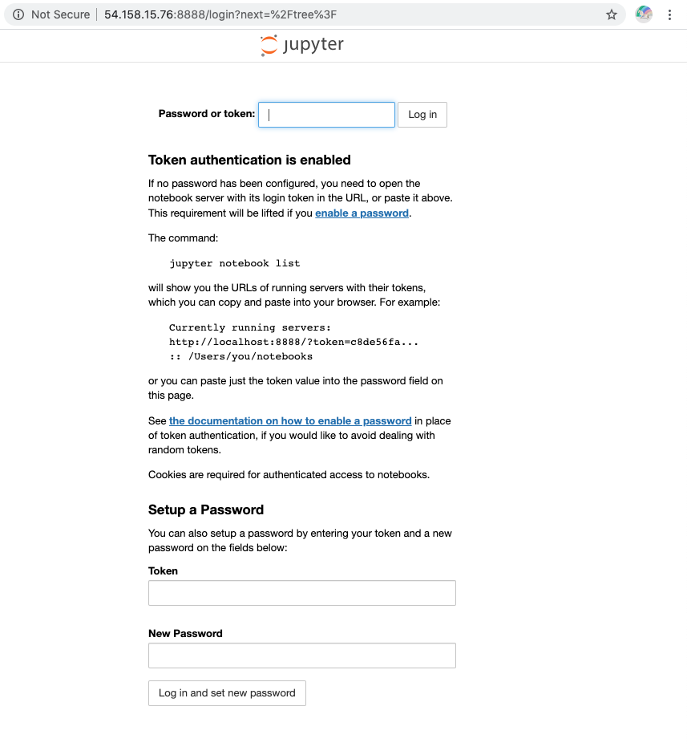
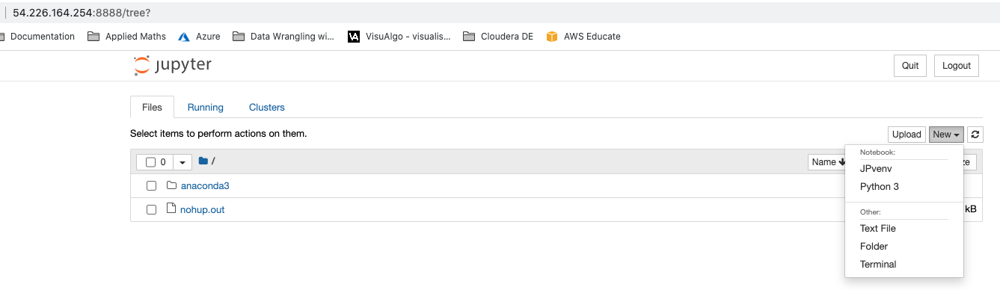

# Setup Jupyter Notebook on EC2

This guide helps you setup Jupyter Notebook on an EC2 instance and lets you install your virtual environment 
as a kernel to use directly from Jupyter Notebook. 

## Step-by-step
This guide assumes that a VPC, public and private subnet have already been created, refer to the documentation: [Pre-requisites](../README.md). 

### Step-1: Launch an EC2 Instance
**AWS Console** -> **Services** -> **EC2**
* Launch instance
* Select Ubuntu Server 18.04 
* Select General purpose t2.micro (free tier elegible) -> Configure Instance Details
* **Network**: Tutorials_VPC
* **Subnet**: Tutorial Public Subnet
* **Auto-assign Public IP**: Enable -> Next: Add Storage -> Next: Add Tags
* Choose a **Name tag**: EC2 in public subnet -> Next: Configure Security Groups
* **Security Group Name**: my-sg-for-ec2-in-public-subnet
* **Description**: allow SSH connection IN and all traffic OUT 
* Rules:
  
    | Type      | Protocol | Port Range | Source    |
    | :---:     |   :---:  | :---:      | :---      |
    | SSH       | TCP      | 22         | 0.0.0.0/0 |
    | Custom TCP| TCP      | 8888       | 0.0.0.0/0 |

* Review and launch -> Launch (don't forget to download the key pair)

### Step-2: Prepare the EC2 instance
* ssh into the instance
```bash
ssh -i "your_key.pem" ubuntu@your-instance-public-ip
```

#### Update local package manager
```bash
sudo apt-get update -y
```

#### Download latest version of Anaconda and install 
```bash
cd /tmp
wget https://repo.anaconda.com/archive/Anaconda3-2020.07-Linux-x86_64.sh
bash Anaconda3-2020.07-Linux-x86_64.sh
```

#### Activate and test installation
```bash
source ~/.bashrc
conda info
```

#### Launch Jupyter Notebook on background mode
```bash
nohup jupyter notebook --ip=0.0.0.0 &
```

Go to ```http://{your-ec2-public-ip}:8888``` and  enter the token displayed in `nohup.out` when your Jupyter Notebook started




#### Create and activate anaconda environment from Jupyter Notebook
```bash
conda create --name venv python=3
conda activate venv
```

#### Link the virtual environment to Jupyter Notebook
```bash
conda install ipykernel -y
python -m ipykernel install --user --name=JPvenv
```

