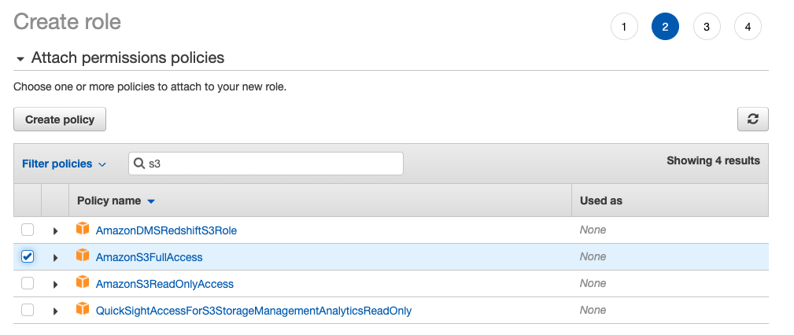

# Upload/download S3 files to EC2 using Python
Write a Python script that uploads a file into s3, launches an EC2 instance and downloads the file into it, do some processing with the file and upload it
 back to s3 and shut down the EC2 instance. 

## Step-by-step
This guide assumes that a VPC, public and private subnet have already been created, refer to the documentation: [Pre-requisites](../README.md). 

### Step-1: Create an IAM Role
We need to authorize the EC2 instance to access the bucket in S3.

**AWS Console** -> **Services** -> **IAM** -> **Roles** -> **Create role**

* Select type of trusted entity: AWS Service
* Choose a use case: EC2
* Select your use case: Allows EC2 instances to call AWS services on your behalf
* Click on **Next: Permissions**
* Attach permissions policy: select **AmazonS3FullAccess** 
* **Role name**: EC2CopyFilesFromS3
* **Role description**: Allow EC2 instances to have access to S3



### Step-2 Run the Python script

```bash
python3 process_s3_on_ec2.py
```

The script will do the following: 
* Create a bucket 
* Upload the files to s3
* Launch the EC2 instance with user data
    * The user data will copy the files in the S3 bucket:

        * **`video_game_sales.csv`**: video games dataset with information about games, platform and sales
        * **`get_top_sales.py`**: script that will process the dataset and export to csv file the global sales of each video game platform

    > NOTE: If you are not sure if the user data was executed succeessfully you can verify the log  `/var/log/cloud-init-output.log`  in the EC2 instance

* Wait until EC2 instance is in **OK** status (when user data has been completed)
* Terminate the EC2 Instance

### Step-3: Verify new file exists on S3
Go to the created bucket and verify the new file `sales_by_platform.csv` exists. 
            