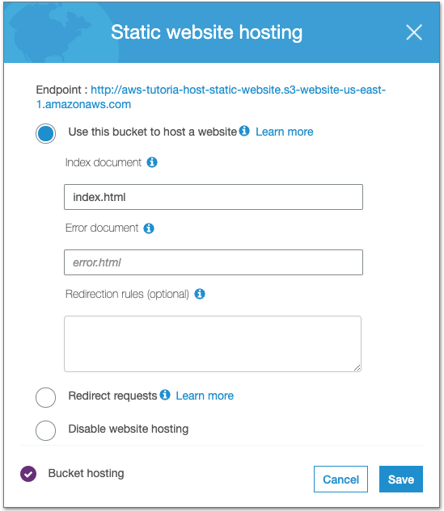
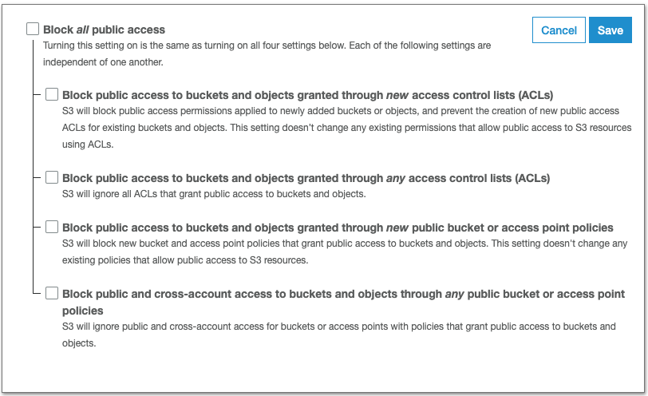

# Host a static website on Amazon s3
Host a static website with an image/video on Amazon s3 

## Step-by-step

### Step-1: Create a bucket on the aws console
**AWS console** -> **Service** -> **S3** ->  **Create bucket**

* **Bucket name**: my-first-website-hosting
* **Region**: US East (N.Virginia)
* Keep all other settings as default 
* **Create bucket**

### Step-2: Enable static website hosting for the bucket
Choose **my-first-website-hosting** bucket -> **Properties** -> **Static website hosting** 
-> **Use this bucket to host a website** 

* **Index document**: ``index.html`` 
* Take note of the **Endpoint** (i.e. http://my-first-website-hosting.s3-website-us-east-1.amazonaws.com)
* Click **Save**



### Step-3: Edit block public access settings
Amazon S3 blocks public access to the account/buckets by default.

Choose **my-first-website-hosting** bucket -> **Permissions**
-> **Edit** -> Clear **Block all public access** --> **Save**




### Step-4: Add a bucket policy
We need to add a bucket policy to grant public read access to the bucket.

Choose **my-first-website-hosting** bucket  -> **Permissions**  -> **Bucket Policy** -> Copy the following bucket policy and paste it in the 
**Bucket policy editor** -> **Save**

```
{
    "Version": "2012-10-17",
    "Statement": [
        {
            "Sid": "PublicReadGetObject",
            "Effect": "Allow",
            "Principal": "*",
            "Action": [
                "s3:GetObject"
            ],
            "Resource": [
                "arn:aws:s3:::my-first-website-hosting/*"
            ]
        }
    ]
}
```


### Step-4 Configure an index document
We need to create the ```index.html``` that we input in **Step-2**. The index document must exactly match de index
 document name that we configured.

**AWS console** -> Choose **my-first-website-hosting** bucket:
  
Upload the index file and the image you are going to display (in this case the image is inside the images folder.

### Step-5 Test the website endpoint
Go to the **Endpoint** given when you enabled **Static website hosting** on **Step-2**. If the browser displays your 
`index.html` page, the website was successfully deployed. 


### Clean-up
* Delete the bucket 